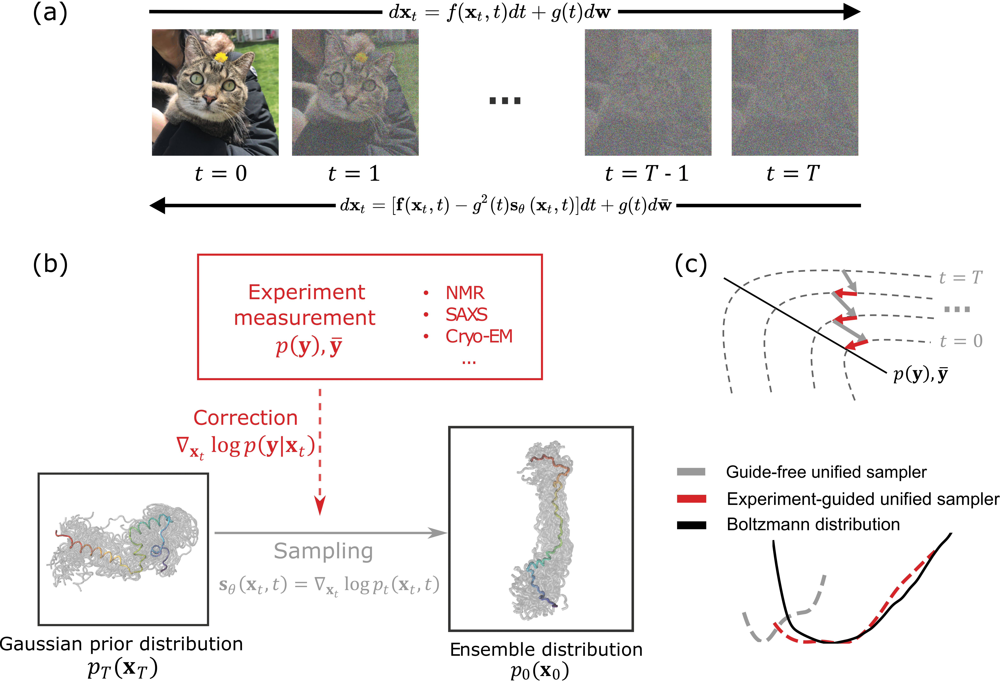

<div align="center">

# EGDiff:  An Experiment-Guided Diffusion model for protein conformational ensemble

<a href="https://pytorch.org/get-started/locally/"></a>
<a href="https://pytorchlightning.ai/"></a>
<a href="https://hydra.cc/"></a>
<a href="https://github.com/ashleve/lightning-hydra-template"></a><br>
[](https://www.biorxiv.org/content/10.1101/2024.10.04.616517v1)

</div>


This repository contains the official implementation of the paper 
"EGDiff: An Experiment-Guided Diffusion Model for Protein Conformational Ensembles." 
EGDiff integrates experimental measurements from NMR, SAXS, 
cryo-EM, and more to guide a pretrained diffusion-based protein ensemble sampler. 
This approach enhances the sampler's ability to produce conformational 
ensembles that align with experimental data while approximating the Boltzmann distribution. 
The current implementation is built on [Str2str](https://github.com/lujiarui/Str2Str.git), a recently developed protein ensemble diffusion sampler, 
but can be adapted to other diffusion-based models.

<p align="center">

</p>

The current model supports guiding the sampling process with end-to-end distance, radius of gyration, helix percent per residue.
Additional, we provide preliminary models guiding with cryo-EM 2D density images:
- End-to-end distance
- Radius of gyration
- Helix percent per residue with distance operator
- RMSD w.r.t the folded structure
- Cryo-EM 2D density images (preliminary)
- Helix percent per residue with RMSD operator (in progress)
- Beta percent per residue with RMSD operator (in progress)


## Installation
```sh
git clone https://github.com/Harrydirk41/EGDiff.git
cd EGDiff

# Create conda environment.
conda env create -f environment.yml
conda activate xendiff

# Support import as a package.
pip install -e .
```
## Inference

There are a few steps to follow before running the sampling: 
- Put the PDB file of the folded protein structure (either from PDB, Alphafold, ESMfold) into '/path/to/EGDiff/data/folded_structure'.
The PDB file serves both as the condition structure for Str2str and the reference structure for RMSD operator. 
- Put experiment measurement samples into '/path/to/EGDiff/data/experiment_samples'. The samples can be saved as a direct 'protein_name/.npy' file or as a pickle file savingGaussian
Mixture Model's parameters in 'path/to/EGDiff/data/GMM_save_list'. An example of the pickle file including end-to-end distance, radius of gyration, and RMSD is provided.
- In 'configs/model/diffusion.yaml', change protein_name and multi_operator_choice to indicate which operator(s) to use for guiding the
sampling process. Additionally, change conditional_noise and conditional_multi_noise to control the guiding strength. 
- For other customized operators,
put the operator function in "/path/to/EGDiff/src/models/operator/operator.py", and indicate whether to use GMM pickle (0) or npy file (1)
to load samples in conditional_GMM_use_prev_sample in 'configs/model/diffusion.yaml'.
- To perform inference, a trained model checkpoint is required and can be specified using `ckpt_path=/path/to/checkpoint`. 
A pretrained PyTorch checkpoint can be accessed from [Google Drive](https://drive.google.com/file/d/1YsvFXOpdst4QxK34GSWvLjgbvzUq4Ry8/view?usp=sharing). 
Download and put it into `data/ckpt`.
```sh
python src/eval.py task_name=inference ckpt_path=/path/to/some/checkpoint
```
- Optionally, to fix physical errors in the generate samples, you can run the following command:
```sh
python /path/to/EGDiff/scripts/run_pdb_fix.py /path/to/pdb_file --gpu_list=0,1 --temp_fix_dir=/path/to/EGDiff/data/temp_fix
```


## Citation

```
@article{liu2024egdiff,
  title={EGDiff: An Experiment-Guided Diffusion model for protein conformational ensemble generation},
  author={Liu, Yikai and Sahoo, Abhilash and Yu, Zongxin and Lin, Guang and Chen, Ming and Hanson, Sonya M},
  journal={bioRxiv},
  pages={2024--10},
  year={2024},
  publisher={Cold Spring Harbor Laboratory}
}

```

